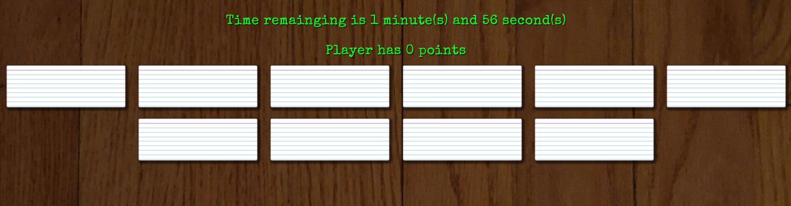
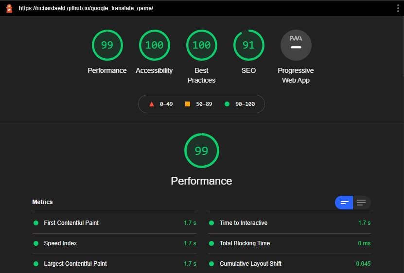
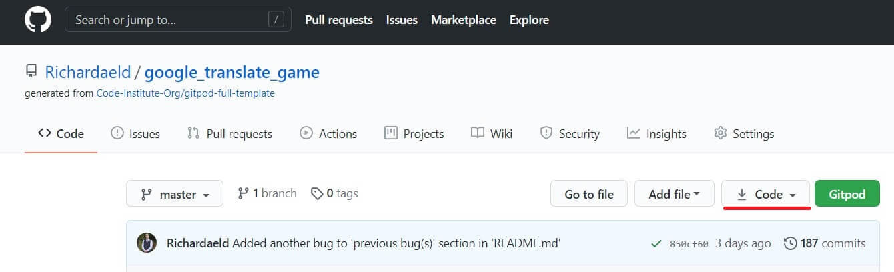
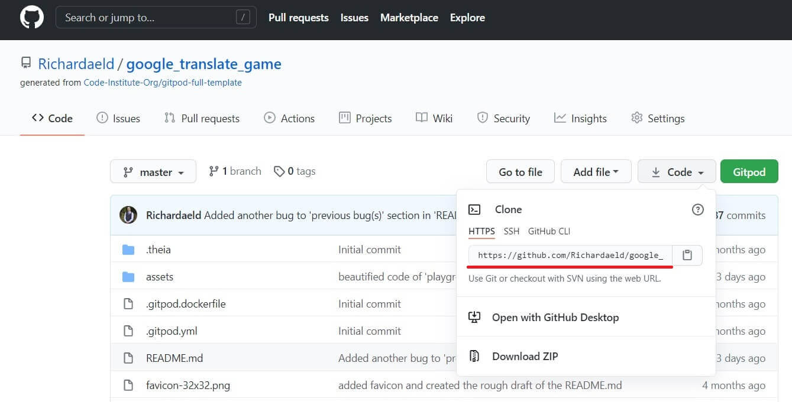
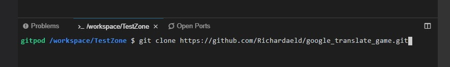
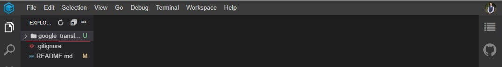

# Contents
[Romancing The Cards - Introduction](#omancing-the-cards)

[UX](#ux)
+ [Goals](#goals)
    + [User Goals](#user-goals)
    + [Developer Goals](#developer-goals)
+ [Client Stories and Experience Provided](#client-stories-and-experience-provided)
    + [Client Stories](#client-stories)
    + [Experience Provided](#experience-provided)
+ [Design Choices](#design-choices)
    + [Game Start Screen](#game-start-screen)
    + [Game Board](#game-board)
    + [Gameplay](#gameplay)
    + [Game Cards](#game-cards)
    + [Page Performance](#page-performance)
+ [Wireframe and Live Demo](#wireframe-and-live-demo)
    + [Wireframe](#wireframe)
    + [Live Demo](#live-demo)
+ [Scalability](#scalability)

[Technology Languages](#technology-languages)

[Testing](#testing)
+ [Developer Testing Specifications](#developer-testing-specifications)
    + [Developer Tested Systems](#developer-tested-systems)
    + [Developer Testing Methods](#developer-testing-methods)
+ [Developer Tests](#developer-tests)
    + [Testing Timer](#testing-timer)
    + [Testing Base Language and Point Calculator](#testing-base-language-and-point-calculator)
    + [Testing Difficulty](#testing-difficulty)
    + [Testing Language Pairings](#testing-language-pairings)
    + [Testing Card Type](#testing-card-type)
+ [Program Tests](#program-tests)
    + [BrowserStack](#browserstack)
    + [Lighthouse](#lighthouse)
    + [JigSaw](#jigSaw)
    + [W3C Validator](#w3c-validator)
    + [JSHint](#jshint)

[Bugs and Other Problems](#bugs-and-other-problems)
+ [Previous Bugs](#previous-bugs)
+ [Current Bugs](#current-bugs)
+ [Other Problems](#other-problems)

[Clone and Deployment Information](#clone-and-deployment-information)
+ [Deploy Clone from GitHub](#deploy-clone-from-github)
+ [GitHub Deployment](#github-deployment)

[Tools and Credits](#tools-and-credits)
+ [Tools](#tools)
+ [Credits](#credits)
    + [Code Citations](#code-citations)
    + [References and Ideas](#references-and-ideas)

[Acknowledgements](#acknowledgements)

----

# omancing The Cards

The purpose of this, JavaScript powered, game is to illustrate how a simple game can entertain and help with learning/memorizing words in a different language. It also has the hidden 
benefit to help improve memory retention by rewarding users that remember where a specific word was located on the board. To help this game be applicable to a wide audience it has 
six selectable languages which the user can choose any combination of. These user selected languages will pull random word pairs from their language banks to keep the user interested
for multiple playthroughs. Other user selectable options are provided to adjust the difficulty of the game for maximum user enjoyment. These options are: the delay between selecting 
cards, time to complete each round, and the number of cards to pair.

# UX
## Goals
### User Goals
+ I want to learn basic words of a new language.
+ I want to be entertained by a game on my browser or cell phone during my free time.
+ I want to work on my memory retention ability.

### Developer Goals 
+ Showcase "Vanilla" JavaScript ability:
    + Have a game that is "Vanilla" JavaScript powered and takes multiple user inputs.
    + Have user inputs that can change the way JavaScript builds the game (Ex. number of cards, multiple languages, background (appearance) of cards, etc...).
    + All cards in game are dynamically added and removed with the start and end of each game round.
    + Game is capable of multiple play throughs without a page refreash.
    + The game timer is a continuously running JavaScript function.
    + The card pair positions are random every time.
    + The words chosen for each game are randomly pulled from the word bank of the user's selected language.

## Client Stories and Experience Provided
### Client Stories
+ As a user, I'd like an enjoyable way to spend my free time.
+ As a user, I'd like a game that helps with memory retention skills.
+ As a user, I'd like to learn some basic words of a different language.
+ As a user, I want a game that challenges me.

### Experience Provided
+ The game has different settings, such as: selectable difficulty, timer length, multiple languages, and total number of card pairs to give a user an enjoyable way to spend 
time with plenty of replay value.
+ The game has an adjustable difficulty that can be used to provide an experience that will challenge the user's memory retention skills.
+ The game currently has six different languages to pick from and they are pairable in any way the user chooses.
+ The game timer, difficulty, and total number of cards can be combined to give the user a over all difficulty setting of novice to literally unwinnable.  

## Design Choices

+ This program is responsive across all devices

### Game Start Screen
+ The game title stands out due to the use of a large font with a dark text shadow.
+ The text descriptions for select/options are placed over a dark background with a bright text color to help them stand out and draw the eye.
+ Multiple user inputs are given for returning and new users alike. 
+ Multiple user inputs allow users to choose how easy or difficult they want to make the game.
+ A selection of six different languages is given to the user. These languages are pairable in any combination.
+ An adjustable difficulty (matching delay) is provided to users. This force users to use their memory over hunting and pecking.

### Game Board
+ A dark background image was used to help the cards stand out.
+ The background was chosen because it resembles a desk or table because this is a typical place to play cards.  

### Gameplay
+ The gameplay is kept intuitive and simple so users can focus on recognizing foreign words or remembering where words were placed.
+ The game header contains a timer and points calculator in an easy to read format. This encourages users to do better each time.
+ The cards are dynamically added/removed and menus disappear/appear with JavaScript when the game starts and ends. This maximizes availiable screen real estate.
+ The game allows multiple playthroughs without having to refresh the browser.
+ A click limiter was installed to keep users from spam clicking to win or break the game. 
+ The game pulls random word pairings from its language bank for each round. This keeps the game feeling fresh and interesting to returning users.

### Game Cards
+ The "index card" of the game cards resemble that of flash cards that school students would use.
+ The font family chosen for the cards mimics a hand-written font and was paired with a bright text color. This combination gives a fun homemade flash card appearance.
+ The "playing card" of the game cards resemble playful deck cards. They give a more fun feeling rather than studious.
+ A CSS effect is applied to the game cards to give them a flipping animation. This gives the game a simple but memorable wow factor.

### Page Performance
+ Code kept simple, clean, and elegant for quicker load times.
+ "Vanilla" JavaScript used over jQuery because of its better performance.
+ Load time checked by [Pingdom](https://tools.pingdom.com/).

+ All images have been compresssed by [tinyPNG](https://tinypng.com/).

## Wireframe and Live Demo
### Wireframe 

+ [Balsamiq](https://balsamiq.com/) was used for the planning process.
+ Wireframes were made for all predetermined size variations of the webpage.
+ Each wireframe that contains cards was given a pointing arrow and a description because of the complexity of the card design.
+ [Click here to view all wireframes associated to this project.](assets/readme/wireframe "Location of wireframes")

### Live Demo

+ A fully functioning demo can be found on GitHub, [here](https://richardaeld.github.io/google_translate_game/ "Deplayment location").
+ [GitHub's](https://github.com/) IDE [GitPod](https://www.gitpod.io/) was used for the construction process.
+ GitHub houses the master branch. 

## Scalability
+ Increase the number of usable words in each language word bank.
+ Add an API that would read out the "pairing langauge" word of a matched card pair.
+ Add a greater selection of card backgrounds to give users a different visual experience according to their preference.
+ Add a game board background selector for a different visual experience for returning users.
+ Change the games select/option listboxes to ul/li JavaScript powered Listboxes. This would allow for greater customization and full support of ARIA.

# Technology Languages
+ HTML - Is the basic construction (foundation) of this webpage.
+ CSS - Used to make the basic construction of this webpage more visually appealing.
+ JavaScript - Allow users to interact with webpage without having to reload page or load multiple pages.

# Testing
## Developer Testing Specifications
### Developer Tested Systems
+ Windows 10 (Chrome 87, Edge 87, Firefox 84)
    + Chrome  
        + Developed in Chrome.
        + Initially tested in every bootstrap breakpoint during development.
        + Tested in landscape, which is desktop responsiveness level. 
        + Tested in portrait, which is tablet responsiveness level.
    + Edge
        + Tested in landscape, which is desktop responsiveness level.
        + Tested in portrait, which is tablet responsiveness level.
    + Firefox
        + Tested in landscape, which is desktop responsiveness level.
        + Tested in portrait, which is tablet responsiveness level.
+ G8 ThinQ (Chrome 87)
    + Chrome
        + Tested in landscape, which is tablet responsiveness level.
        + Tested in portrait, which is mobile responsiveness level.
+ iPad, 5th gen 13.3(Safari 13) 
    + Safari
        + Tested in landscape, which is tablet responsiveness level.
        + Tested in portrait, which is tablet responsiveness level.

### Developer Testing Methods
+ Every **Developer Test** was preformed on the above listed systems at specified screen orientation.
+ Between Landscape and portrait tests, the application was not refreshed. This is a critical part of the test! Part of the test is they are **never** refreshed between tests. This is a test for stability.
+ After completion of **Developer Tests** on each system, the system was tested again with random moments of spam clicking and switching between landscape/tablet.

## Developer Tests
### **Testing Timer**

---

#### Expectation(s):
1. Menus and headers disappear and reappear appropriately.
1. The game's header changes to "You Lose!" when the timer runs out.
1. The game resets to the user selection screen.
1. Header items are easily visible, disappear when not in use, always display correct values.
1. The game never needs to be reloaded to function properly.

#### Assumption(s):
1. Tester will ***not*** reload browser between play throughs.

#### Testing Step(s):
1. Start a game with **default settings**. 
1. Let timer run out and watch the game header change to "You Lose!" and let the game reset.
1. Select a untested amount of **Time on Clock** and start the game.
1. Repeat steps 2 and 3 until all times have been selected. (Be careful not to miss the 1 minute setting.)

#### Document Result(s):
1. Document any incidences of incorrect header presentation.
1. Document any failure of the timer.
1. Document any multiple playthrough errors (mismatching cards, incorrect card placement, etc...).

### **Testing Base Language and Point Calculator**

---

#### Expectation(s):
1. Menus and headers disappear and reappear appropriately.
1. Game tells user when they have won or lost.
1. Header items are easily visible, disappear when not in use, always display correct values.
1. The game never needs to be reloaded to function properly.

#### Assumption(s):
1. Tester will ***not*** reload browser between play throughs.
1. Tester knows the correct content of game's header and when it should be visible.
1. Tester is watching the point calculator as they are playing the game and making sure it is displaying correctly.
1. Tester will occasionally fail a game round just to be sure the lost condition works.
1. Tester always checks for correct word pairings.

#### Testing Step(s):
1. Start game with **default settings** 
1. Win this round. Then, watch game header change to "You Win!". Let the game reset.
1. Change **Number of Pairs** to a untested amount and repeat step 2. 
1. Repeat steps 3 and 2 in that order until you've selected and won on all these **Number of Pairs** options.
1. Change **Base Language** and repeat steps 2 ,3 and 4 in that order.
1. Repeat step 5 until you've selected and won on all these options.

#### Document Result(s):
1. Document any incidences of incorrect header presentation.
1. Document any failure of the timer.
1. Document any incidences of incorrectly accepted/unaccepted word pairings.
1. Document any incorrect win/lose conditions.
1. Document any multiple playthrough errors (mismatching cards, incorrect card placement, etc...).
1. Document any incidences of cards left on the table when they should have disappeared.

### **Testing Difficulty**

---

#### Expectation(s):
1. The difficulty increases a delay between matching card pairs.
1. The game will function according to the specifications of the test, **Testing Base Language and Point Calculator**.

#### Assumption(s):
1. Tester will ***not*** reload browser between play throughs.
1. The tester knows this can make the game extremely difficult or even unwinnable. 
1. The tester knows the card's face div has an ID and the last number of this ID is used to pair the cards.
1. The tester will increase the **time on clock** if needed.
1. The tester may not be able to win on **hard** or **unforgiving** on a tablet or mobile device and that's acceptable. (Detailed in the testing steps.)
1. The tester will intentionally fail a single game on every difficulty level tested. 

#### Testing Step(s):
1. Increase **difficulty** of the game.
1. Run the **Testing Base Language and Point Calculator** test in its entirety.
1. Repeat step 2 on the **hard** **difficulty**. (Attempt to win these rounds but losing most of them wont negatively impact testing.)
1. Repeat step 2 on the **unforgiving** **difficulty**. (Attempt to win these rounds but losing most of them wont negatively impact testing.)

#### Document Result(s):
1. document any incidences of the difficulty not performing properly.
1. Document any incidences of incorrect header presentation.
1. Document any failure of the timer.
1. Document any incidences of incorrectly accepted/unaccepted word pairings.
1. Document any incorrect win/lose conditions.
1. Document any multiple playthrough errors (mismatching cards, incorrect card placement, etc...).
1. Document any incidences of cards left on the table when they should have disappeared.

### **Testing Language Pairings**

---

#### Expectation(s):
1. The game always has the correct pair of words up to match.

#### Assumption(s):
1. Tester will ***not*** reload browser between play throughs.
1. A basic understanding of foreign languages used, a cheat sheet of correct word pairs, or knows the card's face div has an ID and the last number of this ID is used to pair the cards.
1. Tester always checks for correct word pairings.

#### Testing Step(s):
1. Start the game on its **default setting** (add more time to **Time on Clock** if needed).
1. Complete the game.
1. Wait for game to restart.
1. Select the next amount of **Number of Pairs** and repeat steps 2 and 3.
1. repeat steps 4, 2, and then 3 in that order until all **Number of Pairs** have been used.
1. Select the next language of **Pairing Language**, set **Number of Pairs** to 5 pairs, and start game.
1. Repeat steps 2, 3, 4, 5, and 6 until all **Pairing Languages** have been cycled through.
1. Select the next language of **Base Language**, set **Number of Pairs** to 5 pairs, and start the game.
1. Repeat steps 2, 3, 4, 5, 6, and 7 until all **Base Languages** have been cycled through.

#### Document Result(s):
1. Document any incidences of incorrectly accepted/unaccepted word pairings.
1. Document any incidences of cards left on the table when they should have disappeared.

### **Testing Card Type**

---

#### Expectation(s):
1. The game plays the same regardless of card skin chosen. 

#### Assumption(s):
1. Tester will ***not*** reload browser between play throughs.
1. Tester will run all mentioned tests in their entirety. 

#### Testing Step(s):
1. Select **Playing Card** under **Card Type**
1. Run **Developer Test** **Testing Timer** from start to end.
1. Run **Developer Test** **Testing Base Language and Point Calculator**.
1. Run **Developer Test** **Checking Difficulty**.
1. Run **Developer Test** **Checking Language Pairings**.

#### Document Result(s):
1. Any aforementioned **document Results** from the **Developer Tests**.
1. Any card graphical bugs seen during tests. (Ex. misalignment, fading errors, etc...)

## Program Tests
### BrowserStack
+ [Windows 10 (edge 18)](assets/readme/browserstack/win10_edge_18.0.jpg)
+ [OS X Big Sur (Safari 14)](assets/readme/browserstack/macbsr_safari_14.0.jpg)
+ [OS X Big Sur (Chrome 71)](assets/readme/browserstack/macbsr_chrome_71.0.jpg)
+ [Google Nexus 5 (Portrait)](assets/readme/browserstack/4.4_Google-Nexus-5_portrait_real-mobile.jpg)

### Lighthouse

### JigSaw
+ Identifies three errors that are documented in [Other Problems](#other-problems).
+ Identifies one warning. This warning is a vender extension that's required for safari to render text on the cards in the game.

### W3C Validator
+ Identifies one warning that does not require action.

### JSHint
+ Helped find occurrences of missing semicolons and unidentified variables.

# Bugs and Other Problems
## Previous Bugs
+ Occasionally a matching pair of cards will leave a single card on the table, sometimes making the game unwinnable.  This card can be either face up or face down. This bug was
generated by not flashing the "clickRecord" when a user lost the game. **update(This was a two-part bug detailed in the following bug)
+ A single card of a matched pair would occasionally be removed from the game. The user would be awarded a point and the pair would be considered matched. If a user 
clicked fast enough, this bug would get past the program's initial defensive click logic. An additional layer of defensive logic was added to check for identical card ids. This logic 
still compares the two identical card ids chosen during fast clicks. However, the pairing now automatically fails and the single card is flipped back over.
+ Some words with masculine and feminine forms (ex. celles-ci/ceux-ci) exceeded the character limit and would drop to the line below. Which created an an unappealing 
visual appearance. This bug was fixed by a change to font-size units from rem to a combination of rem and vw. However, a pixel width roughly between 1200 and 1166 can still use two 
lines, but now they provide a good visual experience.
+ The background image would not always extend the entire length of the screen on smaller devices. Code from MDN (documented below) was used to find the appropriate length to set "min-height" to. This 
variable was created at the global and local levels. The global variable was used to set the height of the background when the program starts and to "reset" its height after winning 
or losing conditions of the game were met. The local variable was created to set the background after the cards have been created to be sure the background extended appropriately. 
Having these two different scoped variables ensures the program switches appropriately between the different screen heights on all devices. **update(This fix was proven insufficient and made obsolete with 
the fix detailed below)
+ During testing on a mobile device it was discovered that switching from landscape to portrait could leave the background image shorter than the screen height. This bug was later 
found on a desktop device when switching from landscape to portrait. With the initial fix (detailed above) being insufficient the code was refactored into a function to be called on 
the local level in all of the same places as it was before. An additional "resize" event listener was added. This code would not run at the proper time so an additional piece of code 
was used from MDN (window.onresize = foo). This new code sets the screen height whenever a resize is detected.  

## Current Bugs
+ A screen pixel width below 320px or above 4000px will quickly lose a good UX. 

## Other Problems
+ **Jigsaw (Validation Service)** throws an error on ".cardFaceTypeIndex", ".cardBackTypeIndex", and ".cardFaceTypeFun". Despite this error, several browser OS combinations were tested 
(detailed in **Developer Tested Systems**) and none of them had problems with this code. It's very possible that this error is similar to how World Wide Web Consortium validators throw 
errors when a vendor extension is used.
+ The "aria-expanded" state remains while the select/option boxlist isn't expanded. This occurs beacuse of the limitations of select/option. This bug could be triggered when a user 
focuses on the select/option listbox by not directly clicking on the select/option listbox itself. This focus bug could also be triggered by tabbing through the content of the page 
or clicking on the label for the select/option listbox. Another trigger of this bug was when a user selects the same option from a select/option listbox that is currently selected. 
This bug wasnt able to be fixed so the "aria-expanded" state was removed entirely along with its JavaScript code. A solution to add it back in could be with a future update that changes 
the select/option listbox to a ul/li JavaScript powered listbox. With the appropriate JavaScript, this will make the listbox more customizable, capable of a better UX, and more 
friendly towards ARIA states.

# Clone and Deployment Information
## Deploy Clone from GitHub
1. Go to the location of the repository in GitHub, [https://github.com/Richardaeld/google_translate_game](https://github.com/Richardaeld/google_translate_game).
1. Click code button to get the drop down menu (underlined in red).

1. Copy the https address provided (underlined in red).

1. Create a blank or boiler plate GitPod project and open this new GitPod project.
1. Go to the Bash and type, "git clone " and paste the https address found in GitHub page.

1. Press enter.
1. The clone will be created within a folder, titled "google_translate_game" (The original name of the project).

1. Unpack everything from this folder to the root of the GitPod project tree and the project will be fully functional within GitPod.
1. If you wish to deploy outside of GitPod's preview, follow "GitHub Deployment" section below.

## GitHub Deployment
1. Go to the location of the cloned or deployment repository in GitHub.
1. Select Settings at the top of the page (Circled in red in picture below).

1. Go down in settings page until you find the heading "GitHub Pages" (underlined in red in the picture below).
1. Click "None" under the Source subheading (circled in red in picture below).
1. Select the branch you wish to publish.
1. In this example we chose to select master (circled in red in the picture below).

1. Click save (underlined in red in the picture below).

1. Reload page and you will see the layout under Github Pages will change and tell you the page is ready to be published.

1. Once the page is fully published, the layout will change once more and tell you the site has been published.

1. Now the page is fully viewable at the provided HTTP address.

# Tools and Credits
## Tools
+ [Balsamiq](https://balsamiq.com/)
    + Used to produce the wireframes.
+ [Bootstrap](https://getbootstrap.com/)
    + Used as framework.
+ [BrowserStack](https://www.browserstack.com/)
    + Used to check for compatibility errors.
+ [GitHub](https://github.com/)
    + Used for version control and deployment of demo (prototype) website.
+ [GitPod](https://www.gitpod.io/)
    + Integrated development environment used.
+ [Google Fonts](https://fonts.google.com/)
    + Imported font families from here. 
+ [Jigsaw (Validation Service)](https://jigsaw.w3.org/css-validator/)
    + Used to identify errors in CSS.
+ [JSHint](https://jshint.com/)
    + Used to identify errors in JavaScript.
+ [Lighthouse](https://developers.google.com/web/tools/lighthouse)
    + Checks for performance, accessibility, best practices, and SEO.
+ [Pingdom](https://tools.pingdom.com/)
    + Used to check load time.
+ [Techsini](https://techsini.com/multi-mockup/)
    + Used for their viewable responsiveness PNG.
+ [TinyPNG](https://tinypng.com/)
    + Used to Minimize KB load per image.
+ [W3C Validator](https://validator.w3.org/)
    + Used to identify errors in markup.

## Credits
### Code Citations
#### CSS Card Flip Animation
+ This animation's code originated from three different locations. With great effort, these code pieces were melded into something unique to this project but 
still deserves accurate documentation/citation. This code has numerous citations in the CSS where the three main structures of the card's CSS exist (outside, rotating portion, and faces).
A citation was also added to the HTML above the dynamically added content section. The three places where code originated from are: Arjun Khara, MDN Web Docs, and
W3Schools.  All these are documented in detail below.
    + [Arjun Khara](https://www.youtube.com/watch?v=OV8MVmtgmoY)
        + First discovered idea of rotating 3d objects using only CSS [here](https://www.youtube.com/watch?v=OV8MVmtgmoY).
        + Used idea of a single box to contain all moving objects and faces of a card or 3D object.
        + Used ideas from his code to help understand how and where to place items, such as: "backface-visability" and "transform-style" to create desired effect.
    + [MDN Web Docs](https://developer.mozilla.org/en-US/docs/Web/CSS/backface-visibility) 
        + Used idea of a container that rotates 180 degrees with the aid of "backface-visability: hidden" and "transform-style:preserve-3d".
        + Used code placement (ex: where to place "backface-visability" in HTML structure) ideas to help with rotating the cards on the board. This code can be found 
        [here](https://developer.mozilla.org/en-US/docs/Web/CSS/backface-visibility).
        + Used to help understand how "backface-visability: hidden" and "transform-style:preserve-3d" work together to produce the desired effect. This code can be found 
        [here](https://developer.mozilla.org/en-US/docs/Web/CSS/backface-visibility).
    + [W3Schools](https://www.w3schools.com/howto/howto_css_flip_box.asp)
        + Used code and ideas to help with rotating the cards on the game board. This code can be found [here](https://www.w3schools.com/howto/howto_css_flip_box.asp).

#### Random number generator 
+ This JavaScript function was discovered at W3Schools and its code was adapted to accept a variable from the loop which it is run from.
    + [W3Schools](https://www.w3schools.com/js/js_random.asp)
        + Used code format (**Math.floor(Math.random() * number)**) to understand how random works and used custom version that incorporates a 
        variable for this projects random number generator. The code format is found [here](https://www.w3schools.com/js/js_random.asp).

#### Extend Background Image to Bottom of Screen
+ Two lines of code from MDN are responsible for the backbone of this codes function. 
    + [MDN Web Docs](https://developer.mozilla.org/en-US/docs/Web/API/Document/height)
        + Used code that allows JavaScript to dynamically read the length of the screen. This code can be found [here](https://developer.mozilla.org/en-US/docs/Web/API/Document/height).
    + [MDN Web Docs](https://developer.mozilla.org/en-US/docs/Web/API/Window/resize_event)
        + Used code that allows JavaScript to dynamically sense when the screen has been resized. This code can be found [here](https://developer.mozilla.org/en-US/docs/Web/API/Window/resize_event).

### References and Ideas
+ Felipe Souza Alarcon
    + Used idea to place words in JavaScript object(s) for languages banks.
+ [MDN Web Docs](https://developer.mozilla.org/en-US/)
    + Invaluable source of information about JavaScript, HTML, and CSS.
+ [W3Schools](https://www.w3schools.com/)
    + A wonderful resource for element, attribute, and event selection for JavaScript.
    + Extremely helpful for explaing base HTML, CSS, and JavaScript principles. 
+ [World Wide Web Consortium (W3C)](https://www.w3.org/)
    + Used for understanding ARIA content and industry standard use.
    + Multiple standardizations were used from here.
    + The aria standardizations that were specifically drawn from are: 
        + [aria-labelledby to provide a name for user interface controls](https://www.w3.org/WAI/GL/wiki/Using_aria-labelledby_to_provide_a_name_for_user_interface_controls)
        + [ARIA labeling with a dropdown listbox](https://www.w3.org/TR/wai-aria-practices-1.1/examples/listbox/listbox-collapsible.html).
+ [Stack Overflow](https://stackoverflow.com/)
    + Great souce of information for finding a starting place and direction to research.
    + Helped in understanding the importance of loops in JavaScript.
+ [TestLodge](https://blog.testlodge.com/how-to-write-test-cases-for-software-with-sample/)
    + Used to help formulate test syntax structure.
+ [Bootstrap](https://getbootstrap.com/)
    + Framework used to help speed up development and provide a better overall UX.
+ [GitHub](https://github.com/)
    + Used their documentation as this project's deployment basis.
    + [Deployment Information](https://docs.github.com/en/free-pro-team@latest/github/working-with-github-pages/configuring-a-publishing-source-for-your-github-pages-site) - Used the structure of GitHub's deployment information as the 
basis for this project's readme deployment section.
    + [Clone Information](https://docs.github.com/en/github/creating-cloning-and-archiving-repositories/cloning-a-repository) - Used the structure of GitHub's "Cloning a repository" information as the
basis for this project's readme deployment section 
+ Richard Eldridge 
    + Made the game's main background image and icon.

# Acknowledgements
+ Felipe Souza Alarcon for his honest guidance, foresight, and helping lead me into directions I did not know I could go with this project. 
+ Emily Eldridge for help with revising the grammar and flow of this README document.