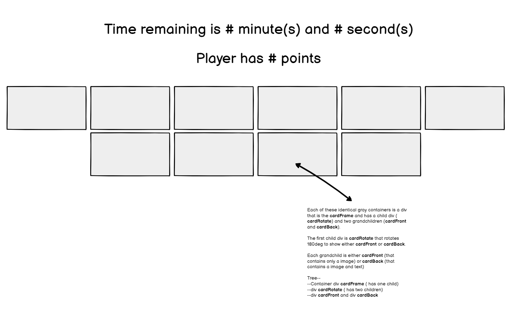
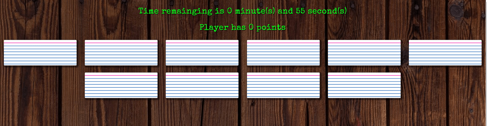
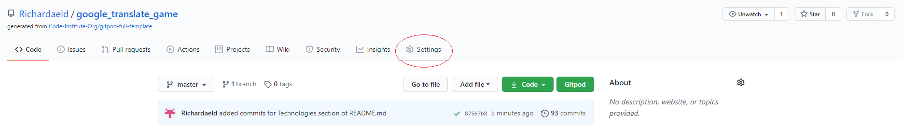
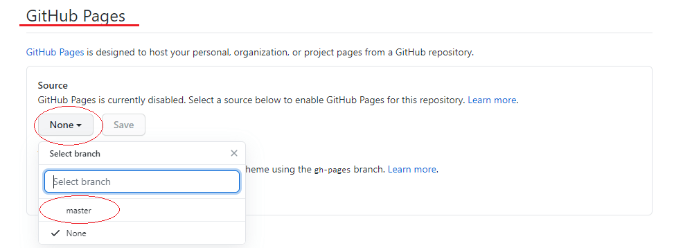
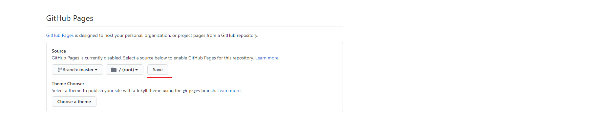
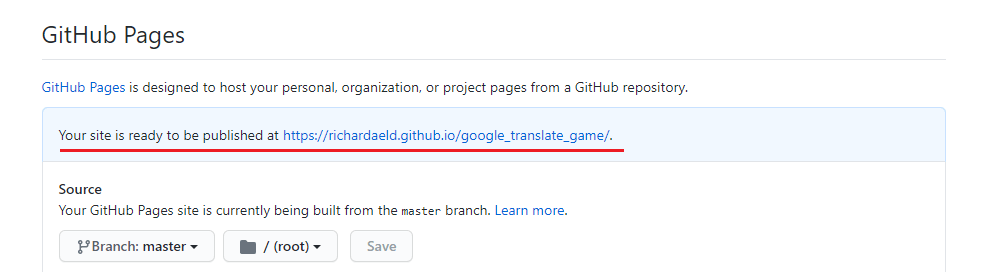
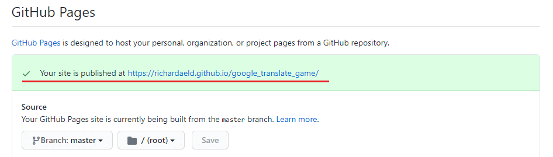
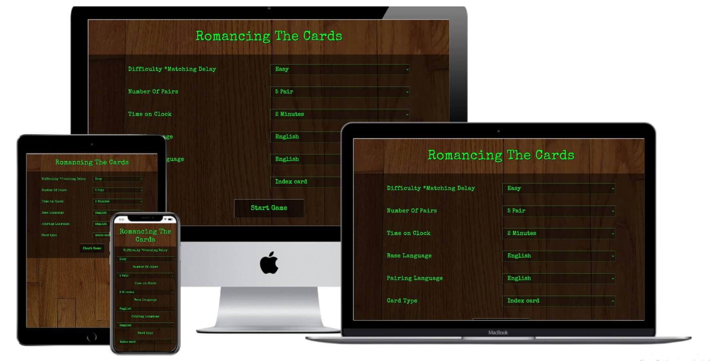
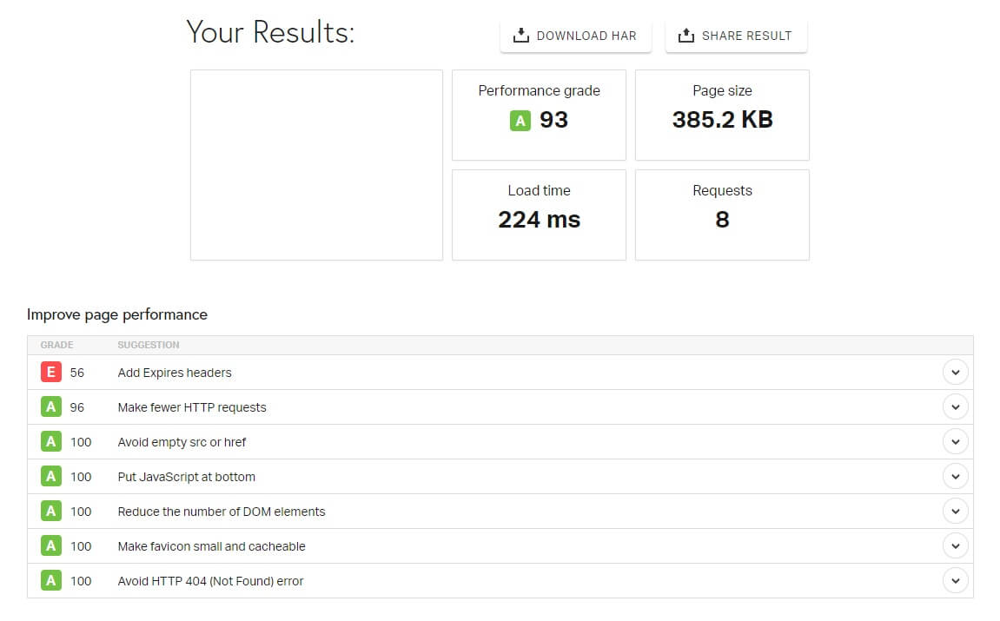
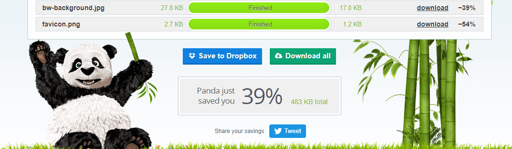

# omancing The Cards

The purpose of this webpage is to illustrate how a simple game can help with learning/memorizing words in a different language. It also has the added bonus of helping repeated
users improve their memory retention ability. This game's premise is the flash card strategy students use to help learn new material. The user picks two languages before the
game starts and then must pair the same word from both user selected languages. The game also adds a timer and point system to give users a goal and sense of urgency to complete 
the game.

# Wireframe and Live Demo
#### Wireframe 

+ Wireframes were made for all predetermined size variations of the webpage.
+ Each wireframe that contains cards was given a pointing arrow and a description because of the complexity of the card design.
+ [Click here to view all wireframes associated to this project.](assets/readme/wireframe "location of wireframes")

#### Live Demo

+ A fully functioning demo can be found on GitHub, [here](https://richardaeld.github.io/google_translate_game/ "deplayment location")
+ GitHub's IDE GitPod was used for the entire construction and planning process.
+ GitHub houses the master branch.

# Deployment Information
+ Go to the location of the respository in GitHub (ex. https://github.com/Richardaeld/google_translate_game).
+ Select Settings at the top of the page (Circled in red in picture below).

+ Go down in settings page until you find the heading "GitHub Pages" (underlined in red in the picture below).
+ Click "None" under the Source subheading (circled in red in picture below).
+ Select the branch you wish to publish.
+ In this example we chose to select master (circled in red in the picture below).

+ Click save (underlined in red in the picture below).

+ Reload page and you will see the layout under Github Pages will change and tell you the page is ready to be published.

+ Once the page has fully published the layout will change once more and tell you the site has published.

+ Now the page is fully viewable at the provided HTTP address.

# UX Choices 

### Game Start Screen
+ The game title stands out because of the use of a large font with a dark text shadow
+ The text descriptions/choices are placed over a dark background with a bright text color to help them stand out and draw the eye

### Game Board and Game Play
+ A dark picture background was used to help the cards stand out.
+ The background image of the game cards resembles that of flash cards that school students would use.
+ The font family chosen for the cards resembles hand writting and was paired with a bright text color to give the feeling of home made flash cards.
+ Selectable card backgrounds were added to give repeated users something different to look at. 

### Page Performance
+ Code kept simple, clean, and elegant for quicker load times.
+ Load time checked by [Pingdom](https://tools.pingdom.com/).

+ All images have been compresssd by [tinyPNG](https://tinypng.com/).

# Brand Identity
This game should give the feeling of studying at home or in school for an exam and is accomplished though:
+ The use of a background that resembles a desk or dining room table.
+ The default cards are ment to resemble index cards that would be used like flash cards to help someone study.
+ The font used on the cards was ment to resemble hand writting to give the feeling of a hand made card.
+ A bright color was used to give users the feeling of personality from someone that might use a highlighter to make studying more fun.

# Client Stories and Experience Provided
## Client Stories
+ As a user, I'd like an enjoyable way to spend my free time.
+ As a user, I'd like a game that forces me to use my mental retaining ability.
+ As a user, I'd like to learn some basic words of a different language.

## Experience Provided
+ The game has adjustable difficulty, timer, languages and total card pairs to give a user an enjoyable way to spend time with plenty of replay value.
+ The game has adjustable difficulty that can be used to provide an experience that will cause the user to lose if they only hunt and peck.
+ The game currently has six different languages to pick from and they are pairable in any way the user chooses.

# Testing
## Header items, Lose/Win Conditions, and Multiple Round Playability
#### Expectation(s):
1. Menues disappear when not in use.
1. Game tells user when they have won or lost.
1. Header items are easily visible, disappear when not in use, always display correct values.
1. The game never needs to be reloaded to function properly.

#### Assumption(s):
1. Tester will ***not*** reload browser between play throughs.
1. Tester knows the correct content of game's header and when it should be visible.

#### Testing Step(s):
1. Start a game with **default settings**. 
1. Let time run out, watch the game header to change to "You Lose!" and let game reset.
1. Select next level of **Time on Clock** and start the game.
1. Repeat steps 2 and 3 until all times have been selected.
1. Start another game, win this round, and watch game header to change to "You Win!" and let game reset.
1. Change **Number of Pairs** and repeat step 5.
1. Change **Base Language** and repeat step 5.
1. Change **Difficulty** (increase **time on clock** if needed) and repeat step 5. 

#### Document Result(s):
1. Document any incidences of incorrect header presentation.
1. Document any failure of timer.
1. Document any incorrect win/lose conditions.
1. Document any multiple playthrough errors (mismatching cards, incorrect card placement, etc...).
------------------------------------------------------

## Checking Language Pairings
#### Expectation(s):
1. The game always has the correct pair of words up to match.

#### Assumption(s):
1. A basic understanding of foreign languages used or a cheat sheet of correct word pairs.
1. Tester will ***not*** reload browser between play throughs.

#### Testing Step(s):
1. Start the game on its **default setting** (add more time to **Time on Clock** if needed).
1. Complete the game.
1. Wait for game to restart.
1. Select the next amount of **Number of Pairs** and repeat steps 2 and 3.
1. repeat steps 4, 2, and then 3 in that order until all **Number of Pairs** have been used.
1. Select the next language of **Pairing Language**, reset **Number of Pairs** to 5 pairs, and start game.
1. Repeat steps 2, 3, 4, 5, and 6 until all Pairing Languages have been cycled through.

#### Document Result(s):
1. Document any incidences of incorrect, game accepted or not accepted word pairings.
1. Document any incidences of cards left on the table when they should have disappeared.

--------------------------------

## Previous and Current bugs
#### Previous Bug(s)
+ Occasionally a matching pair of cards will leave a single card on the table, sometimes making the game unwinnable.  This card can be either face up or face down. This bug was
generated by not flashing the "clickRecord" when a user lost the game.
+ Some words with masculine and feminine forms (ex. celles-ci/ceux-ci) excede the character limit of line space and drop to the line below. This was creating an unappealing 
visual appearance. This bug was fixed by a change to font-size unites from rem to a combination of rem and vw. However a pixel width roughly between 1200 and 1166 can still use two 
lines but now they retain a good visual experience.
+ A screen pixel width below 320px or above 4000px quickly lose a good visual experience. 

## Scaleability
+ Add an api that would read out the 'pairing langauge' word of a matched card.
+ Add a greater selection of different card backgrounds to give the user a different visual experience according to their preference.
+ Add a game board background selector for a different visual experience for returning users.

# Tools, References, Code, and idea(s) used
## Tools
+ [Bootstrap](https://getbootstrap.com/) - Used as framework
+ [GitHub](https://github.com/) - Deployment of demo(prototype) website
+ [GitPod](https://www.gitpod.io/) - Integrated development environment used
+ [Google Fonts](https://fonts.google.com/) - Used font families found from here 
+ [Jigsaw (Validation Service)](https://jigsaw.w3.org/css-validator/) - Used to identify errors in CSS
+ [Pingdom](https://tools.pingdom.com/) - Used to check for load time
+ [Techsini](https://techsini.com/multi-mockup/) - Used for their viewable responsiveness PNG
+ [TinyPNG](https://tinypng.com/) - Used to Minimize KB load per image
+ [W3C Validator](https://validator.w3.org/) - Used to identify errors in markup

## References, Ideas Code Used
+ [MDN web docs](https://developer.mozilla.org/en-US/docs/Web/JavaScript) - Invaluable source of information about JavaScript, HTML, and CSS
    + Used a piece of code to allow background to travel entire length of page
    + Used code and idea to help with rotating the cards on the board
    + Used to help understand how 'backface-visability: hidden' and "transform-style:preserve-3d" work together
    + The idea used was a container that rotates 180 degrees with the aid of 'backface-visability: hidden' and "transform-style:preserve-3d"
+ [Stack Overflow](https://stackoverflow.com/) - Helped with understands importance of loops in JavaScript
+ [TestLodge](https://blog.testlodge.com/how-to-write-test-cases-for-software-with-sample/) - Used for test case examples
+ [W3Schools](https://www.w3schools.com/) - A wonderful resource of element, attribute, and event selection for JavaScript
    + Used code and idea's to help with rotating the cards on the game board
+ [Bootstrap](https://getbootstrap.com/) - Framework used to help speed up development and add a better UX:
+ [github](https://docs.github.com/en/enterprise/2.14/user/articles/configuring-a-publishing-source-for-github-pages) - Using the style and 
structure of githubs deployment information as the basis of the readme's deployment section
+ [Arjun Khara](https://www.youtube.com/watch?v=OV8MVmtgmoY) - Use a single box to contain all moving objects and faces of a card or 3D object.
    + Used idea's from his code to help understand how and were to place items like 'backface-visability' and 'transform-style' to create desired effect.
+ [maxnyla's deployment section from her readme](https://github.com/maxnyla/Pawsome) - the idea was using githubs literal deployment process in the readme's deployment section 

# Technologies (langauges) used
+ HTML - Is the basic construction (foundation) of this webpage
+ CSS - Makes the basic construction of this webpage more visually appealing 
+ JavaScript - Allow users to interact with webpage without having to reload page or load multiple pages

# Acknowledgements
+ Felipe Souza Alarcon for his honest guidence, foresight, and providing stellar hints to questions I hadnt asked yet. 
+ Emily Grooms for help in revising this README document.